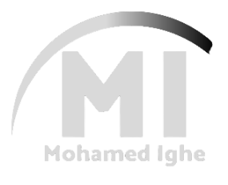

<a name="readme-top"></a>

<div align="center">
  
  <br/>

  <h3><b>My Portfolio Website</b></h3>

</div>

# 📗 Table of Contents

- [📖 About the Project](#about-project)
  - [🛠 Built With](#built-with)
    - [Tech Stack](#tech-stack)
    - [Key Features](#key-features)
  - [🚀 Live Demo](#live-demo)
- [💻 Getting Started](#getting-started)
  - [Prerequisites](#prerequisites)
  - [Setup](#setup)
  - [Install](#install)
  - [Usage](#usage)
  - [Run tests](#run-tests)
  - [Deployment](#deployment)
- [👥 Authors](#authors)
- [🔭 Future Features](#future-features)
- [🤝 Contributing](#contributing)
- [⭐️ Show your support](#support)
- [🙏 Acknowledgements](#acknowledgements)
- [📝 License](#license)

# 📖 My Portfolio Website <a name="about-project"></a>

Step into the world of my creative journey as you explore my portfolio! Here, you'll discover a curated collection of my projects that reflect my passion, skills, and dedication. Take a closer look at the intricate details of each endeavor, from innovative concepts to polished executions. Delve into my professional background and experience, gaining insights into the diverse challenges I've tackled and conquered. Uncover the building blocks of my knowledge and expertise through an in-depth exploration of my educational journey. Whether you're here to appreciate the aesthetics of my designs, understand the strategy behind my projects, or trace the evolution of my skills, this portfolio is your gateway to understanding the essence of who I am as a creative professional. Enjoy the seamless navigation, and feel free to reach out with any questions or opportunities for collaboration.

## 🛠 Built With <a name="built-with"></a>

### Tech Stack <a name="tech-stack"></a>

<details>
  <summary>Client</summary>
  <ul>
    <li><a href="https://reactjs.org/">React.js</a></li>
  </ul>
</details>

<details>
  <summary>Server</summary>
  <ul>
    <li><a href="https://expressjs.com/">Express.js</a></li>
  </ul>
</details>

<details>
<summary>Database</summary>
  <ul>
    <li><a href="https://www.postgresql.org/">PostgreSQL</a></li>
  </ul>
</details>

### Key Features <a name="key-features"></a>

The features incorporated into my personal portfolio website are as follows:

- **Home:** A webpage featuring a concise overview, skills, and portfolio.
- **Portfolio:** Displays a portfolio featuring more than 15 projects developed with robust technology stacks, incorporating HTML5/CSS3, JavaScript, React/Redux, API, Ruby, and Ruby on Rails.
- **About:** Offers a concise self-introduction, highlights my skill set, and establishes connections with various social media networks.
- **Contact:** Encourages users to leave a message if they are interested in initiating a project or require assistance with coding activities.

<p align="right">(<a href="#readme-top">back to top</a>)</p>

## 🚀 Live Demo <a name="live-demo"></a>

- [Live Demo Link](https://katarighe.vercel.app/)

<p align="right">(<a href="#readme-top">back to top</a>)</p>

## 💻 Getting Started <a name="getting-started"></a>

> Describe how a new developer could make use of your project.

To get a local copy up and running, follow these steps.

### Prerequisites

In order to run this project you need:

<!--
Example command:

```sh
 gem install rails
```
 -->

### Setup

Clone this repository to your desired folder:

<!--
Example commands:

```sh
  cd my-folder
  git clone git@github.com:myaccount/my-project.git
```
--->

### Install

Install this project with:

<!--
Example command:

```sh
  cd my-project
  gem install
```
--->

### Usage

To run the project, execute the following command:

<!--
Example command:

```sh
  rails server
```
--->

### Run tests

To run tests, run the following command:

<!--
Example command:

```sh
  bin/rails test test/models/article_test.rb
```
--->

### Deployment

You can deploy this project using:

<!--
Example:

```sh

```
 -->

<p align="right">(<a href="#readme-top">back to top</a>)</p>

## 👥 Authors <a name="authors"></a>

👤 **Mohamed Aden Ighe**

- GitHub: [@katarighe](https://github.com/katarighe)
- Twitter: [@katarighe](https://twitter.com/katarighe)
- LinkedIn: [@mighe](https://linkedin.com/in/mighe)

<p align="right">(<a href="#readme-top">back to top</a>)</p>

## 🔭 Future Features <a name="future-features"></a>

> Describe 1 - 3 features you will add to the project.

- [ ] **[new_feature_1]**
- [ ] **[new_feature_2]**
- [ ] **[new_feature_3]**

<p align="right">(<a href="#readme-top">back to top</a>)</p>

## 🤝 Contributing <a name="contributing"></a>

Contributions, issues, and feature requests are welcome!

Feel free to check the [issues page](../../issues/).

<p align="right">(<a href="#readme-top">back to top</a>)</p>

## ⭐️ Show your support <a name="support"></a>

Give a star⭐️ or a thumbs up 👍 if you like this project! You can visit my GitHub profile for more of my projects.

<p align="right">(<a href="#readme-top">back to top</a>)</p>

## 🙏 Acknowledgments <a name="acknowledgements"></a>

- I want to express my gratitude to my colleague [Ticoniq](https://github.com/ticoniq/) for assisting me in constructing this portfolio website from scratch.
- [Link to the original design theme](https://github.com/ticoniq/portfolio-design)
- Project supervised by [Microverse](https://www.microverse.org/)
- [Creative Commons 4.0 License](https://creativecommons.org/licenses/by-nc/4.0/)

<p align="right">(<a href="#readme-top">back to top</a>)</p>

## 📝 License <a name="license"></a>

This project is [MIT](./LICENSE) licensed.

<p align="right">(<a href="#readme-top">back to top</a>)</p>